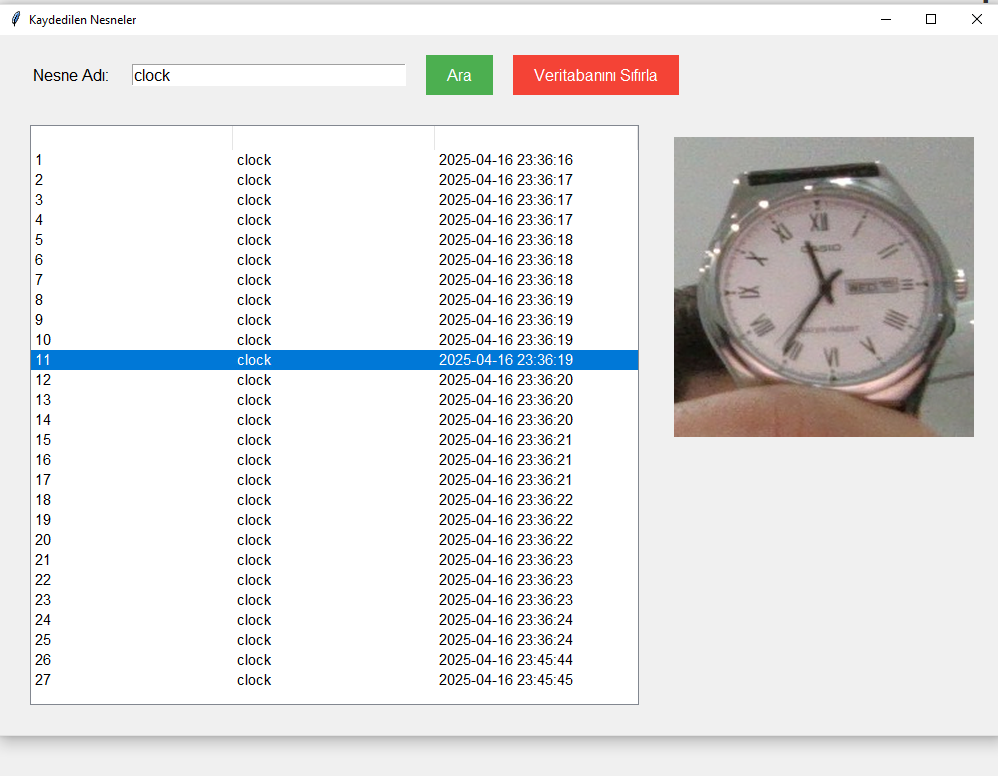

# 🎯 Gerçek Zamanlı Nesne Tanıma Sistemi

Bu proje, YOLO (You Only Look Once) algoritması kullanarak gerçek zamanlı nesne tanıma yapan gelişmiş bir Python uygulamasıdır. Kullanıcı dostu arayüzü ile seçilen nesneleri tespit eder, veritabanında saklar ve geçmiş kayıtları görüntüleme imkanı sunar.

## ✨ Özellikler

- **Gerçek Zamanlı Nesne Tanıma**: YOLO v3 modeli ile yüksek doğrulukta nesne tespiti
- **Seçici Nesne Tespiti**: Sadece istediğiniz nesneleri tespit etme
- **Türkçe Arayüz**: Kullanıcı dostu Türkçe arayüz
- **Veritabanı Entegrasyonu**: Tespit edilen nesneleri SQLite veritabanında saklama
- **Görsel Kayıt Sistemi**: Tespit edilen nesnelerin görüntülerini otomatik kaydetme
- **Arama ve Filtreleme**: Kaydedilen nesneleri arama ve görüntüleme
- **Modern GUI**: Tkinter ile oluşturulmuş modern kullanıcı arayüzü

## 🖼️ Ekran Görüntüleri

<div align="center">
  
  
  
</div>

## 🚀 Kurulum

### Gereksinimler

- Python 3.7+
- Webcam (kamera erişimi için)

### Adım 1: Projeyi İndirin

```bash
git clone https://github.com/kullaniciadi/opencv-project.git
cd opencv-project
```

### Adım 2: Gerekli Kütüphaneleri Yükleyin

```bash
pip install -r requirements.txt
```

Eğer `requirements.txt` dosyası yoksa, aşağıdaki komutları çalıştırın:

```bash
pip install opencv-python
pip install numpy
pip install pillow
pip install tkinter
```

### Adım 3: YOLO Model Dosyalarını İndirin

**ÖNEMLİ**: YOLO model dosyaları boyutları büyük olduğu için GitHub'a yüklenmemiştir. Bu dosyaları manuel olarak indirmeniz gerekmektedir.

#### YOLO Model Dosyalarını İndirme:

1. **yolov3.weights** dosyasını indirin:
   ```bash
   wget https://pjreddie.com/media/files/yolov3.weights
   ```
   Veya tarayıcınızdan şu adrese gidin: https://pjreddie.com/media/files/yolov3.weights

2. **yolov3.cfg** dosyasını indirin:
   ```bash
   wget https://raw.githubusercontent.com/pjreddie/darknet/master/cfg/yolov3.cfg
   ```
   Veya tarayıcınızdan şu adrese gidin: https://raw.githubusercontent.com/pjreddie/darknet/master/cfg/yolov3.cfg

3. **coco.names** dosyasını indirin:
   ```bash
   wget https://raw.githubusercontent.com/pjreddie/darknet/master/data/coco.names
   ```
   Veya tarayıcınızdan şu adrese gidin: https://raw.githubusercontent.com/pjreddie/darknet/master/data/coco.names

**Not**: İndirdiğiniz dosyaları proje ana dizinine yerleştirin. Dosya boyutları:
- yolov3.weights: ~236 MB
- yolov3.cfg: ~1 KB  
- coco.names: ~625 bytes

## 🎮 Kullanım

### Ana Uygulamayı Başlatma

```bash
python main.py
```

### Kullanım Adımları

1. **Nesne Seçimi**: Ana ekranda tespit etmek istediğiniz nesneleri işaretleyin
2. **Kamera Başlatma**: "Canlı Kamera Başlat" butonuna tıklayın
3. **Nesne Tespiti**: Kamera açıldığında seçili nesneler otomatik olarak tespit edilir
4. **Kayıt Görüntüleme**: "Kaydedilen Nesneler" butonu ile geçmiş kayıtları görüntüleyin

### Kamera Kontrolleri

- **Q**: Kamerayı kapat
- **V**: Kaydedilen nesneleri görüntüle

## 📁 Proje Yapısı

```
opencv-project/
├── main.py              # Ana uygulama dosyası
├── canli_kamera.py      # Kamera ve nesne tespit modülü
├── nesneler.db          # SQLite veritabanı
├── yolov3.weights       # YOLO model ağırlıkları
├── yolov3.cfg           # YOLO model konfigürasyonu
├── coco.names           # COCO sınıf isimleri
├── read/                # Proje görselleri
│   ├── 1.png
│   ├── 2.png
│   └── 3.png
└── README.md            # Bu dosya
```

## 🔧 Teknik Detaylar

### Kullanılan Teknolojiler

- **OpenCV**: Görüntü işleme ve kamera kontrolü
- **YOLO v3**: Nesne tespit algoritması
- **SQLite**: Veritabanı yönetimi
- **Tkinter**: Kullanıcı arayüzü
- **NumPy**: Sayısal işlemler
- **PIL**: Görüntü işleme

### Desteklenen Nesneler

Sistem COCO veri setindeki 80 farklı nesne türünü destekler:
- Kişi, araç, hayvan, eşya kategorileri
- Türkçe çeviriler ile kullanıcı dostu arayüz

### Veritabanı Yapısı

```sql
CREATE TABLE nesneler (
    id INTEGER PRIMARY KEY AUTOINCREMENT,
    nesne_adi TEXT,
    kayit_tarihi TEXT,
    nesne_resmi BLOB
);
```

## 🛠️ Geliştirme

### Katkıda Bulunma

1. Bu repository'yi fork edin
2. Yeni bir branch oluşturun (`git checkout -b feature/yeni-ozellik`)
3. Değişikliklerinizi commit edin (`git commit -am 'Yeni özellik eklendi'`)
4. Branch'inizi push edin (`git push origin feature/yeni-ozellik`)
5. Pull Request oluşturun

### Hata Bildirimi

Bir hata ile karşılaştığınızda:
1. GitHub Issues bölümünde yeni bir issue oluşturun
2. Hatanın detaylı açıklamasını yapın
3. Hata mesajlarını ve ekran görüntülerini ekleyin

## 📄 Lisans

Bu proje MIT lisansı altında lisanslanmıştır. Detaylar için `LICENSE` dosyasına bakın.

## 👨‍💻 Geliştirici

**Murat Abi** - [GitHub Profili](https://github.com/kullaniciadi)

## 🙏 Teşekkürler

- [OpenCV](https://opencv.org/) - Görüntü işleme kütüphanesi
- [YOLO](https://pjreddie.com/darknet/yolo/) - Nesne tespit algoritması
- [COCO Dataset](https://cocodataset.org/) - Nesne tanıma veri seti

## 📞 İletişim

Proje hakkında sorularınız için:
- GitHub Issues: [Proje Issues](https://github.com/kullaniciadi/opencv-project/issues)
- Email: ornek@email.com

---

⭐ Bu projeyi beğendiyseniz yıldız vermeyi unutmayın!
